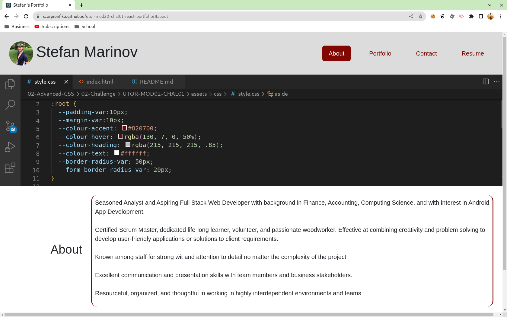
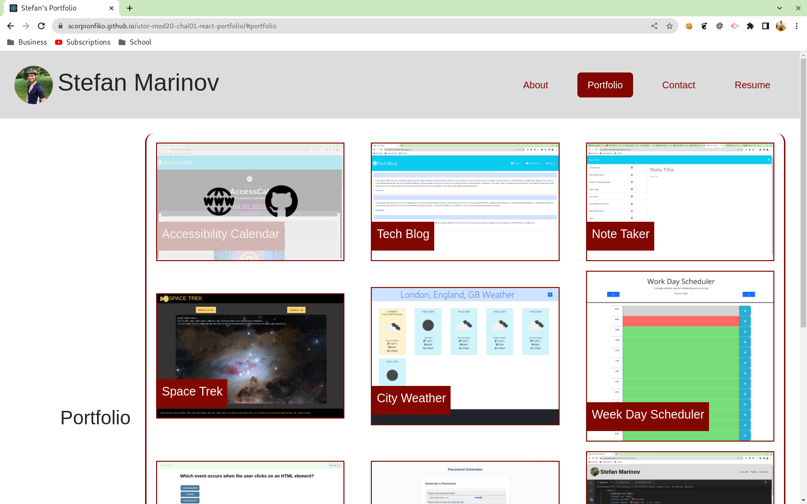
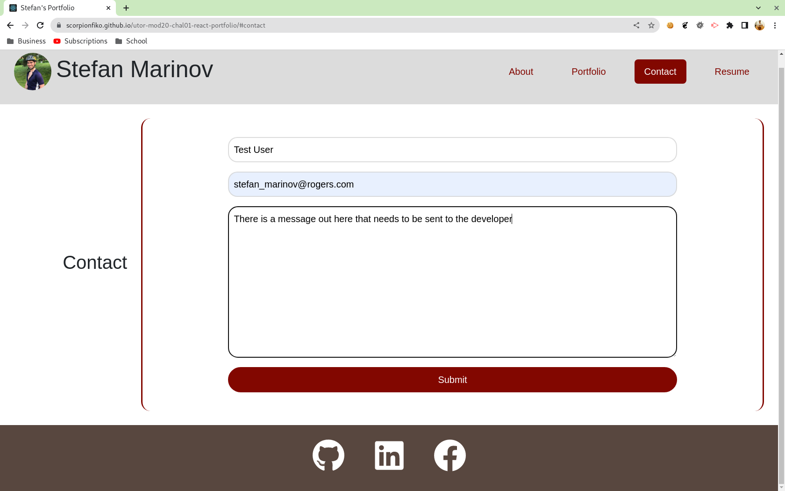
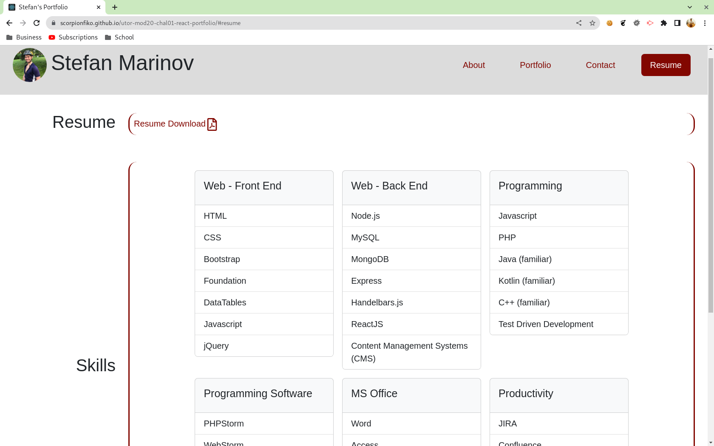

# UTOR-MOD20-CHAL01-React-Portfolio
University of Toronto - Module 20 - Challenge 01 - React Portfolio

## Description

Repository containing the code for the Developer Portfolio using React. This is primarily a front application that shows the user information about the developer, their portfolio, contact, and resume. The application is greatly inspired by the original developer profile that was created earlier in the year. This profile kicks it up a notch: 
- it is built using ReactJS
- it shows all projects by the developer. Hovering on the project image allows the user to go to either the github repo or the live website.
- it has a fully functional contact form where a user can send a message to the developer's email.
- it proives the user with a PDF version of the developer's resume.

The application is fully responsive and being able to be viewed on all devices.

Below is the image of the About page.

Below is the image of of the Portfolio page.

Below is the image of the Contact page.

Below is the image of the Resume page.

## Table of Contents

- [Installation](#installation)
- [Functionality](#functionality)
- [Usage](#usage)
- [Credits](#credits)
- [Tests](#tests)
- [License](#license)
- [Walktrough](#walkthrough)
- [Future Development](#future-development)

## Installation

No special installation requirements. Simply visit https://scorpionfiko.github.io/utor-mod20-chal01-react-portfolio/ to use the application.

back to [Table of Contents](#table-of-contents)

## Functionality

The following discusses at a high level about some of the features of the website. Detailed code implementation can be found as comments in the JS files.

### Bootstrap and Custom CSS:

The front end is designed with a mixture of Bootstrap and user defined elements. In addition, some of the default bootstrap colours have been changed to suit the theme of the website.

### Backend readiness:

Even though this applicatoin is front-end only, the seeds for a back-end implementation have been sown. The information for the portfolio and resume's skill section are obtained from internal arrays (to simulate data coming from a database) and displayed on the screen using the array.map method. In the future, this particular application will be further enhanced to store portfolio information in a back end database. This means that the developer will be able to log in and update information without the need to touch the code.

### EmailJS:

EmailJS has been used to send the email from the contact form to the developer's email address. This makes the form fully usable in case the user wants to contact the developer. The only limitation is 200 emails a month as those are the maximums set by Email JS in their Free Subscription.

back to [Table of Contents](#table-of-contents)

## Usage

To access application
1. Go to https://scorpionfiko.github.io/utor-mod20-chal01-react-portfolio/ to access the application
2. Use the top hand navigation links to scroll through the page
    1. About: default page shows a summary of the user's experiences
    2. Portfolio: shows all projects worked by the developer so far. Hovering over the image will display an overlay with links to both Github repo or live website
    3. Contact: displays three fields: name, email, message. The user needs to fill all of them before being able to send the message. Otherwise, error messages will appear underneath each field showing the error.
    4. Resume: this shows the developer's resume as well as summary of the developer's technical skills
    5. Footer: shows links to the developer's Github, LinkedIN, and Facebook profile pages

back to [Table of Contents](#table-of-contents)

## Credits
n/a

back to [Table of Contents](#table-of-contents)

## Tests

All tests have been performed manually using Chrome.

back to [Table of Contents](#table-of-contents)

## License

Please refer to the LICENSE in the repo.

back to [Table of Contents](#table-of-contents)

## Walkthrough

No walkthrough video required

back to [Table of Contents](#table-of-contents)

## Future Development

Here are some of the items to be considered for future development.
1. Change the top navigation links to hamburger component
2. Add developer log in and back end
3. Convert to PWA

back to [Table of Contents](#table-of-contents)
